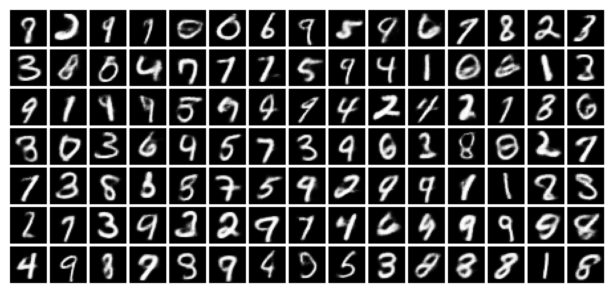
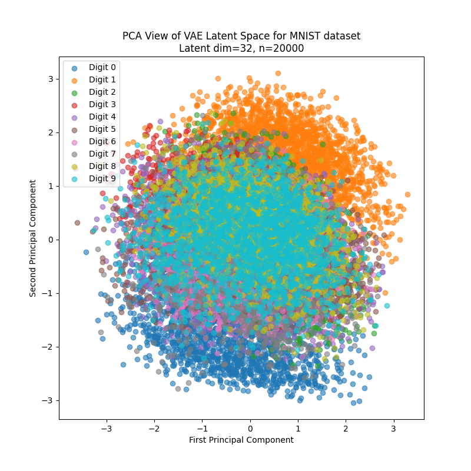

# Generative Modelling - OMR

This repository provides implementations of generative models for studying the probabilistic modeling of MNIST digits. The work focuses on two fundamental approaches:

- A Variational Autoencoder (VAE) that constructs a lower-dimensional probabilistic latent representation of digit images through maximization of the evidence lower bound (ELBO), enabling both compression and reconstruction

- A Normalizing Flow (NF) model that learns a bijective mapping between the image distribution and a tractable base distribution via a sequence of invertible transformations, permitting direct likelihood computation and sampling

The codebase contains implementations for training, generation, and analysis of the latent representations and sampling characteristics. Core functionality is implemented in JAX/Equinox, with visualization via matplotlib/seaborn and experiment tracking through Weights & Biases.

Core capabilities:
- Efficient model optimization on TPU and GPU architectures
- Visualization tools for examining generated samples and latent space interpolation
- Latent space analysis via dimensionality reduction and clustering techniques
- Investigation of mode collapse phenomena and intrinsic dimensionality

# Results

Here are generated images for the VAE model trained on MNIST, plus a 2D slice of the latent space (dim=32).




# Setup
Install [uv](https://github.com/astral-sh/uv) (fast pip alternative)

On macOS or Linux:
```bash
curl -LsSf https://astral.sh/uv/install.sh | sh

# or with brew
brew install uv
```

On Windows:
```bash
powershell -c "irm https://astral.sh/uv/install.ps1 | iex"
```

## Install dependencies

```bash
uv sync
# on TPU
uv run pip install jax[tpu] --find-links https://storage.googleapis.com/jax-releases/libtpu_releases.html
# on CPU (not tested)
uv run pip install jax
```

```bash
# Download dataset
curl https://storage.googleapis.com/tensorflow/tf-keras-datasets/mnist.npz --output mnist.npz
# Run vae
uv run train_vae.py # see Usage
```

## Usage

Requires wandb login.


```bash
uv run wandb login
```

Train a Variational Autoencoder:
```bash
# Basic training
uv run train_vae.py

# Configure hyperparameters
uv run train_vae.py --output-folder runs/vae --latent-dim 32 --learning-rate 0.001 --batch-size 64 --num-epochs 50 --num-vis-samples 10 --seed 42 --wandb-project vae-mnist

# Generate samples from trained model
uv run gen_vae.py --model-path runs/vae/<run_id>/vae_final.eqx

# Generate interpolations between random points
uv run gen_vae.py --model-path runs/vae/<run_id>/vae_final.eqx --mode interpolate
```

## Investigation ideas

- K-means clustering on MNIST
  - theoretically talk about measuring difficult by how multi-modal
  - also by how close the clusters are
- PCA for visualising clusters of latent space that correspond to images
- NFs might converge on one mode
- Mode collapse


## Ideas
- Try different latent space for VAE (dim=16)
  - Try limit testing it to find intrinsic dimensionality

- Sum of gaussians doesn't simplify in objective functions
